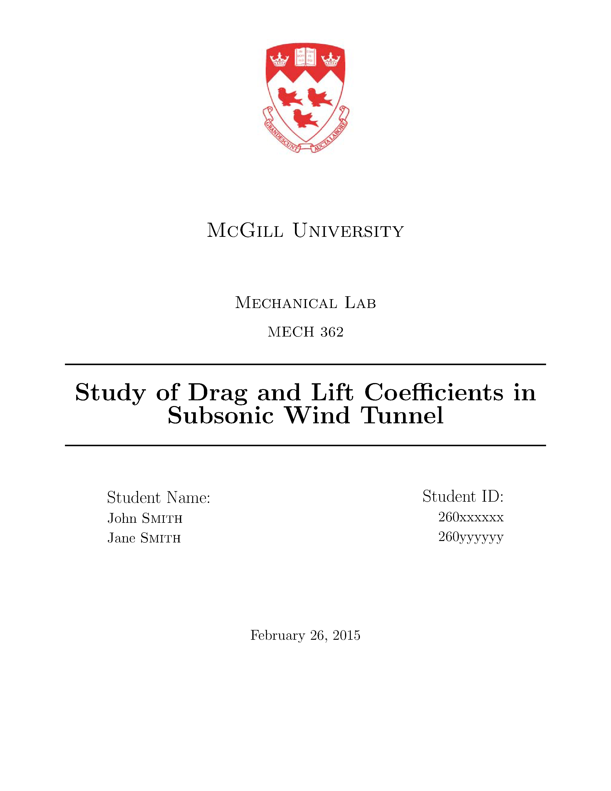
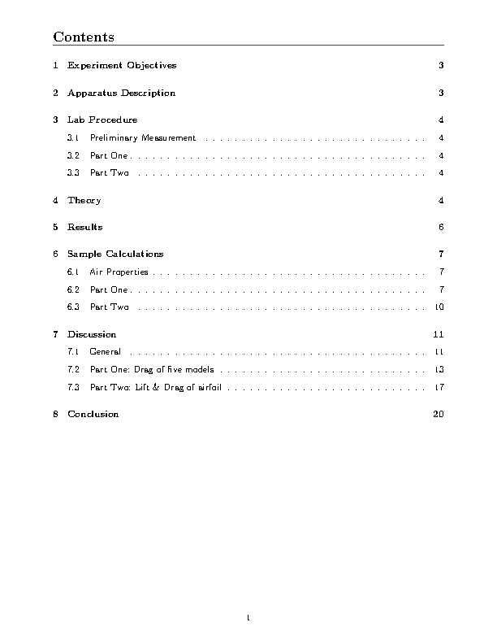
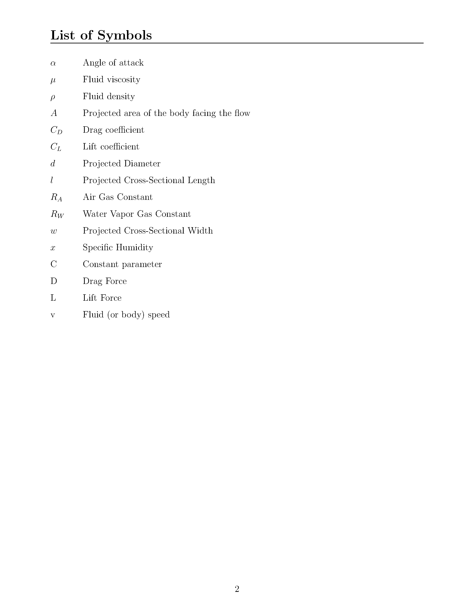
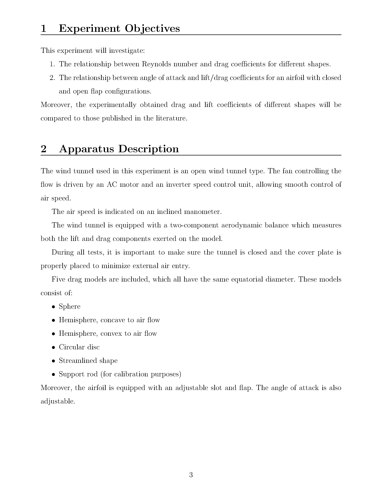
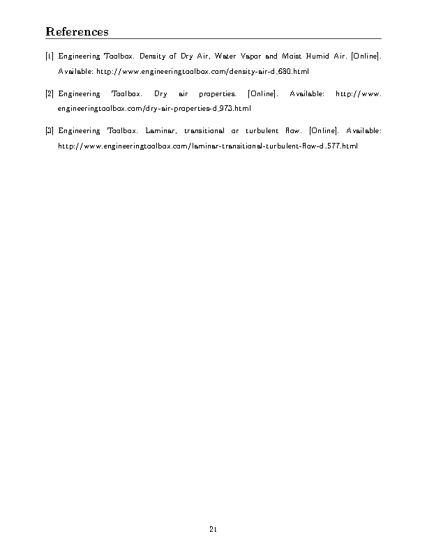

cookiecutter-latex-mcgill
=========================

A template for writing LaTeX documents. See https://github.com/audreyr/cookiecutter.

* Title Page fields are automatically populated. Also includes McGill University logo (see **Background**)
* Nomenclature: Ready for nomenclature printing. *Make Index* script provided (see **Nomenclature**).
* BibTeX: Set up to use BibTeX (IEEE style).

See **Output** at bottom for screenshots and sample PDF.

Usage
-----

Install *cookiecutter*

    pip install cookiecutter

Generate a LaTeX project:

    cookiecutter https://github.com/kreger51/cookiecutter-latex-mcgill.git

Start writing your document! Suggested use is to create new *.tex* file and include it using

    \include{<file_name>.tex}

Background
----------

I am an engineering student at McGill University, hence the McGill logo and IEEE bibliography style.
I wrote the document class ``SelimArticle.cls`` because I always use more or less the same packages.

*I am in no way affiliated with McGill University*

Features
--------
### Nomenclature

The [nomencl](http://cs.brown.edu/about/system/managed/latex/doc/nomencl.pdf)
package makes formatting a nomenclature a walk in the park.

**Basic Usage:**
* Add ``[nomencl]`` option to ``\documentclass``.
* Uncomment ``\printnomenclature`` in ``main.tex``.
* Add symbols to list of symbols using ``\nomenclature`` command (see documentation).
* Run ``makeidx.bat`` from command prompt.
* Build ``main.tex`` once or twice.

TODO: Conditional

### BibTeX

An empty ``dabib.bib`` file is included with the template. Bibliography is included at the bottom of ``main.tex``.

TODO: Conditional

### Title Page

Title page formatting is done in ``mypage.sty`` package, and parameters such as student ID, name, course name etc... is currently done in ``options.tex``.

If you don't feel the need for the package, you must pass option ``[NoTitlePage]`` to ``\documentclass``, as it is a required package of the class. Alternatively, you can edit the class itself and remove the requirement.

**Logo:**
The McGill logo is taken from ``logo.jpg``. To change the logo, replace the file with your own.

### Document Class

I use my own document class (``SelimArticle.cls``). Take a look at it to see which packages are automatically required -- a short summary of why each package is used is provided.

## Not Exactly What You Want?

### Similar Cookiecutter Templates

No similar templates yet.

### Fork This / Create Your Own

If you have differences in your preferred setup, I encourage you to fork this
to create your own version. Or create your own; it doesn't strictly have to
be a fork.

* Once you have your own version working, add it to the Similar Cookiecutter
  Templates list above with a brief description.

* It's up to you whether or not to rename your fork/own version. Do whatever
  you think sounds good.

### Or Submit a Pull Request

I also accept pull requests on this, if they make my own experience better.

# Output

[Sample PDF](bin/example.pdf)

**Screenshots:**

